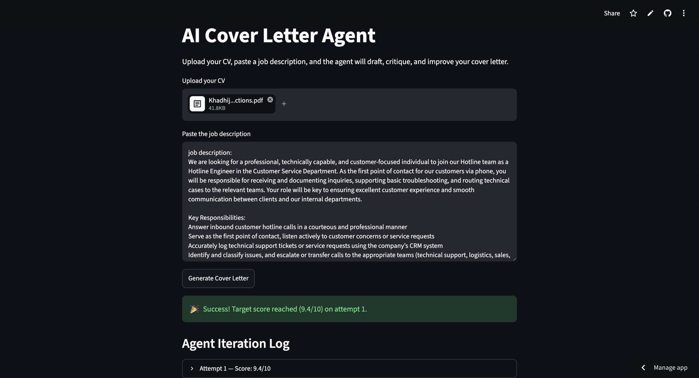
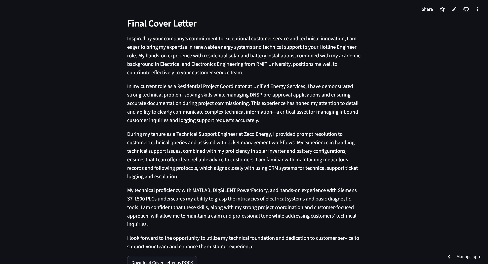

# AI Cover Letter Agent

An AI-powered web application that helps users generate tailored cover letters by uploading their CV and pasting a job description. The agent drafts, critiques, improves, and scores the cover letter until it reaches a strong quality score.

## Project Overview

The AI Cover Letter Agent is designed to support job seekers by creating personalised cover letters that match their resume experience with the requirements of a specific job description.

Users can upload their CV, paste a job description, and generate a professional cover letter. The application also includes an agent iteration system that evaluates the cover letter and improves it automatically.

## Features

- Upload CV in PDF format
- Paste any job description
- Generate a tailored cover letter using AI
- Agent-based improvement loop
- Cover letter scoring system
- Iteration log showing improvement attempts
- Download final cover letter as a DOCX file
- Clean and simple Streamlit interface

## Screenshots

### Main Application Page



### Generated Cover Letter Output



## Tech Stack

- Python
- Streamlit
- OpenAI API
- LangChain / Agent workflow
- PyPDF2 or pdfplumber for CV text extraction
- python-docx for DOCX generation
- dotenv for environment variable management

## How It Works

1. The user uploads their CV.
2. The user pastes the job description.
3. The application extracts relevant information from the CV.
4. The AI agent compares the CV with the job requirements.
5. A personalised cover letter is generated.
6. The agent critiques and scores the output.
7. If the score is below the target, the agent improves the cover letter.
8. The final cover letter can be downloaded as a DOCX file.

## Project Structure

```text
cover-letter-agent/
│
├── app.py
├── requirements.txt
├── README.md
├── .gitignore
├── .env.example
├── screenshots/
│   ├── app-main.png
│   └── final-cover-letter.png
└── outputs/
    └── generated_cover_letter.docx